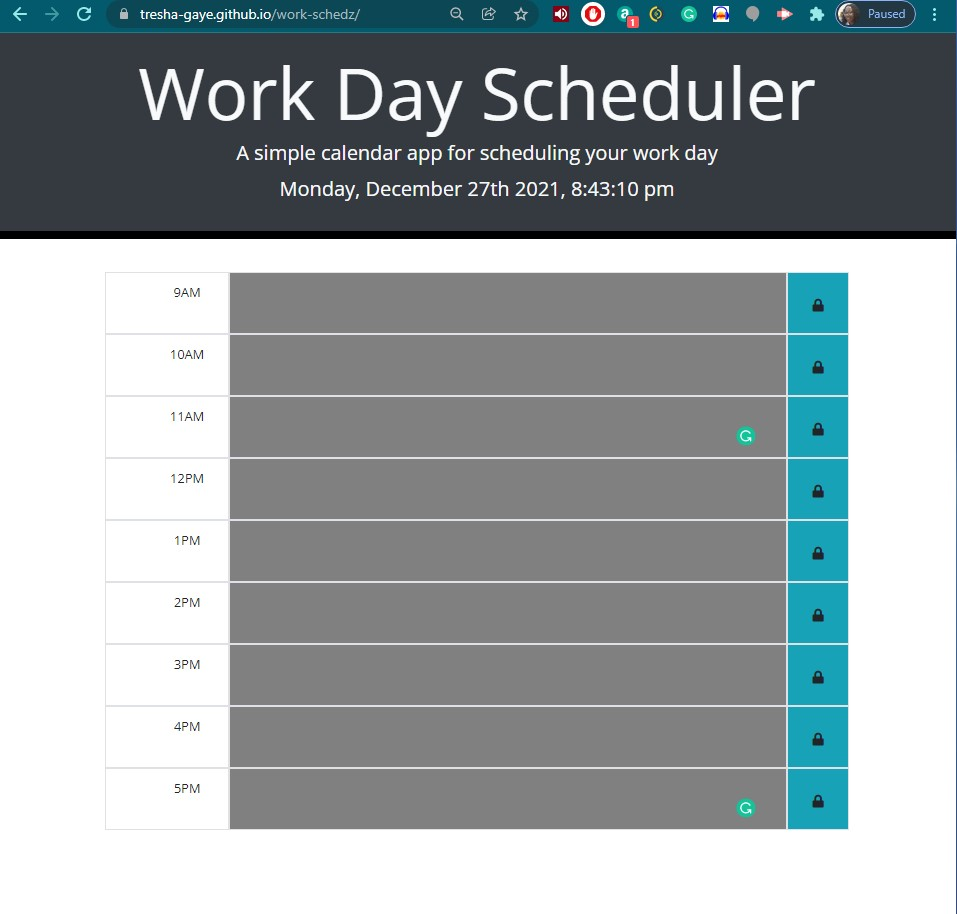
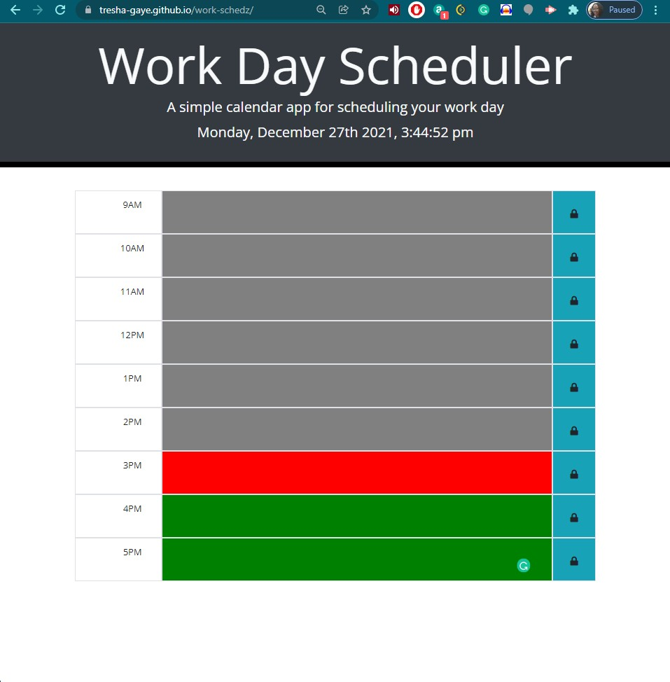

# Work Day Scheduler

This application uses Third Party APIs such as Jquery, Bootstrap and Moment.js to create a responsive, dymanic Work Day Scheduler.

View the deployed application by [clicking this link](https://tresha-gaye.github.io/work-schedz/).

## Criteria 

**Required features**

- the app is required to display the current dat at the top of the calendar. I added functionality to dynamically update the time every second because otherwise the time only changes when the page is refreshed. 
- the app should include timeblocks for standard business hours (9:00 a.m. to 5:00 p.m.), which are color coded to indicate whether the timwblock is in the past, present or future.
- the app features the ability to enter tasks/events in an input field, which can then be saved in local storage and be available after the page is refreshed.

Below is are screenshots of the app showing the functionality outside and within business hours:

**Accomplishments**

The Work Day Scheduler version 2 has the following features:
- used semantic `textarea` elements were used for text input instead of `div` + `form` elements previously used in version 1, to make it easier to create the 'click to save' function.
- used semantic `button` element to contain the lock-box instead of a generic `div`, more attractive and easier to enable 'click' function.
- created additional `div` containers to hold related items: time-/task-/lock-boxes for each hour, which enabled the effective use of the sibling() method in the click function.
- updated click function to capture user input by linking the save `button` to the value of the `textarea`where the user enters each task.
- updated function to save to, and retrieve from, `localStorage`, including using a `for` loop to set the key/value pairs for each task-box class.   

## Contributing

## Credits

**The following resources were used to complete this project:**
1. UCONN Coding Bootcamp's modules on JavaScript
2. Bootstrap library [Bootstrap] (https://getbootstrap.com/)
3. StackOverflow resources [Stack Overflow] (https://stackoverflow.com/)

## License
[GNU](https://opensource.org/licenses/GPL-3.0)

